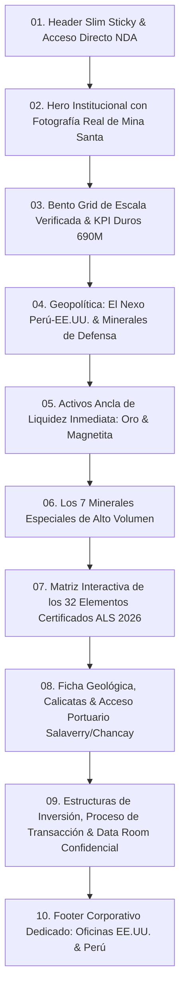

# PRD: Rediseño Integral de la Plataforma Institucional "Las Arenas del Santa"

**URL de Producción:** [santa.sondecapital.com](https://santa.sondecapital.com/)  
**Ruta del Código Fuente:** [`src/pages/proyectos/arenas-del-santa.astro`](file:///home/laptop/Documentos/mineria-sondecapital/src/pages/proyectos/arenas-del-santa.astro)  
**Sistema de Diseño de Referencia:** [`design.md`](file:///home/laptop/Documentos/mineria-sondecapital/design.md)  
**Documento Técnico Fuente:** [`docs/Mina Santa/Inversión_Mina Arenas_del_Santa 2026 EEUU.docx`](file:///home/laptop/Documentos/mineria-sondecapital/docs/Mina%20Santa/Inversi%C3%B3n_Mina%20Arenas_del_Santa%202026%20EEUU.docx)  
**Guía de Correcciones & Directrices de Dirección:** [`docs/Mina Santa/Correcciones WEB Santa.docx`](file:///home/laptop/Documentos/mineria-sondecapital/docs/Mina%20Santa/Correcciones%20WEB%20Santa.docx)  
**Catálogo & Modelos Cuantitativos:** [`docs/Mina Santa/Tablas Tierras Raras Santa.xlsx`](file:///home/laptop/Documentos/mineria-sondecapital/docs/Mina%20Santa/Tablas%20Tierras%20Raras%20Santa.xlsx)  
**Activos Fotográficos Reales del Yacimiento:** [`docs/Mina Santa/Frontal.png`](file:///home/laptop/Documentos/mineria-sondecapital/docs/Mina%20Santa/Frontal.png), [`docs/Mina Santa/Frontal 2.png`](file:///home/laptop/Documentos/mineria-sondecapital/docs/Mina%20Santa/Frontal%202.png), [`docs/Mina Santa/Captura de pantalla 2026-09-07 170325.png`](file:///home/laptop/Documentos/mineria-sondecapital/docs/Mina%20Santa/Captura%20de%20pantalla%202026-09-07%20170325.png), [`docs/Mina Santa/magnetita.webp`](file:///home/laptop/Documentos/mineria-sondecapital/docs/Mina%20Santa/magnetita.webp)  
**Versión:** 2.0 (Alineación Geopolítica EE.UU., Exclusión de Gráficos Obsoletos, Catálogo de 32 Minerales + 7 Especiales, y Experiencia Dinámica On-Scroll)

---

## 1. Visión, Enfoque y Objetivos del Producto

### 1.1. Propósito Central: Rigor Técnico, Persuasión Soberana y Alianza Occidental
La plataforma web de **Las Arenas del Santa** (subdominio `santa.sondecapital.com`) es un canal institucional exclusivo de banca de inversión (*Private Equity*) y desinversión de activos mineros estratégicos. Su meta es **informar con máxima precisión científica y persuadir a tomadores de decisiones de alto nivel** (fondos soberanos, departamentos de defensa, consorcios mineros globales y compradores industriales estadounidenses y aliados de la OCDE) sobre la oportunidad de adquisición o asociación en este singular depósito costero.

> [!IMPORTANT]
> **Mandato de Contenido Oficial (Dirección Sonde Capital):**
> 1. **Reorientación Geopolítica Total:** Se erradica por completo la anterior narrativa vinculada a India. El activo se posiciona bajo el eje **"El Nexo Perú-EE.UU.: Una Ventana Táctica"**, enmarcado en el **Memorándum de Entendimiento sobre Cooperación en Minerales Críticos y Tierras Raras firmado entre Perú y EE.UU. (febrero de 2026)**, y en la imperativa necesidad del Pentágono y la industria de defensa occidental de asegurar Hafnio, Escandio y Tierras Raras Pesadas fuera de la órbita de China.
> 2. **Eliminación de Gráficos Genéricos:** Se excluye totalmente la sección *"Dashboard de Análisis de Placer"* (gráficos estáticos de barras de tenores y gráficos circulares de dona) por considerarse no representativos y reemplazables por datos duros estructurados.
> 3. **Doble Motor de Valorización:** Destacar con fuerza el flujo de caja inmediato que aporta el **Oro** (valor refugio a niveles récord de $4,400/oz con 20 millones de oz de potencial: USD 86.6 Billion) junto con el colosal volumen industrial de la **Magnetita** (700 millones de TM: USD 70 Billion para acero verde), respaldando el desarrollo de la monacita y los minerales críticos de alta tecnología.
> 4. **Exclusividad de Marca:** El proyecto cuenta con su propia identidad y footer corporativo independiente, sin mezclas cruzadas con Borboyona o Tocllano, destacando las oficinas de Sonde Capital en **Allen, TX (EE.UU.)** y **San Isidro, Lima (Perú)**.

### 1.2. Audiencia Objetivo
- **Comités de Adquisición de EE.UU. y la OTAN:** Entidades que buscan asegurar suministros de Hafnio (reactores nucleares y semiconductores) y Escandio (superaleaciones aeroespaciales para cazas F-35 y misiles hipersónicos).
- **Procesadores Industriales de Norteamérica:** Refinerías como la nueva planta de separación de tierras raras pesadas de Aclara Resources en Luisiana (US$ 277 millones), que requieren concentrados de monacita no provenientes de China.
- **Fondos de Minería Institucional e Inversionistas Estratégicos:** Interesados en el precio de venta de **$690 MM USD** para la compra total del activo, o en esquemas de Joint Venture y contratos de suministro a largo plazo EXW.
- **Siderúrgicas Globales de Acero Verde:** Demandantes de concentrados de magnetita de alta ley (62-65% Fe).

### 1.3. Objetivos de Conversión y KPI de Experiencia
1. **Validación Instantánea:** En menos de 5 segundos, el visitante institucional debe comprender la escala del depósito: **$690 MM USD de venta**, **2,100 hectáreas**, **32 elementos certificados por ALS (2026)**, **700 MM TM de magnetita** y **20 MM oz de oro potencial**.
2. **Navegación Táctica sin Fricciones:** Permitir transitar desde la crisis geopolítica global hasta el detalle de ensayos de laboratorio y modelos de adquisición mediante micro-interacciones suaves y anclajes directos.
3. **Exploración Viva de Minerales:** Fomentar la interacción con los 7 minerales ancla y la tabla dinámica de 32 elementos críticos mediante filtros, modales detallados y estados hover de alta gama.
4. **Captura Cualificada de Inversionistas:** Conducir al usuario calificado a formalizar la solicitud de Data Room confidencial bajo estándares KYC/AML.

---

## 2. Sistema de Diseño y Pila Visual (`design.md` Execution)

El rediseño sigue con estricta fidelidad las normas de [`design.md`](file:///home/laptop/Documentos/mineria-sondecapital/design.md):

### 2.1. Tokens de Color y Atmósfera
- **Fondo Base y Superficies:** Blanco puro (`#FFFFFF`) y pizarra suave (`#F8FAFC`, `#F1F5F9`) para las áreas de lectura técnica e inspección de tablas, intercalado con bloques de alto contraste en Azul Marino Financiero profundo (`#090D16`, `#0F172A`).
- **Acentos de Valor Institucional:**
  - Oro / Ámbar Metálico (`#F59E0B`, `#D97706`, `#B45309`) para botones primarios, ribetes de tarjetas clave, tenores y detalles geológicos.
  - Verde Esmeralda / Teal Técnico (`#0D9488`, `#14B8A6`) para sellos de certificación de laboratorio, leyes positivas y acuerdos internacionales.
  - Azul Eléctrico Táctico (`#2563EB`, `#38BDF8`) para el nexo logístico de puertos (Salaverry, Chancay) y la alianza bilateral EE.UU.-Perú.

### 2.2. Tipografía Fintech & Tablas Numéricas
- **Títulos y Display:** `Plus Jakarta Sans` en pesos 700 (Bold) y 800 (ExtraBold), con tracking ligeramente ceñido para transmitir solidez arquitectónica.
- **Lectura Técnica y Métricas:** `Inter` en pesos 400, 500 y 600.
- **Alineación Numérica Obligatoria:** Todas las cantidades en dólares, porcentajes, toneladas y concentraciones ppm implementarán `font-variant-numeric: tabular-nums;` para un alineamiento vertical perfecto en tablas e indicadores.

### 2.3. Habilidades de Animación y Micro-Interacciones
- **`animation-on-scroll`:** Disparo de animaciones fluidas al entrar en viewport (fade-in, slide-up de 16px, coreografía escalonada en grids).
- **`animation-systems`:** Transiciones suaves sin saltos bruscos (`cubic-bezier(0.16, 1, 0.3, 1)`).
- **`beautiful-shadows`:** Sombras neutrales multicapa sin saturación excesiva (`box-shadow: 0 4px 20px -2px rgba(15, 23, 42, 0.05)`).
- **`css-border-gradient`:** Bordes sutilmente iluminados en la tarjeta de Oro, Magnetita y en la opción de Compra Total de $690 MM.

---

## 3. Matriz de Cambios Respecto a la Versión Anterior

| Componente / Sección | Estado Anterior (v1.0) | Nuevo Enfoque Requerido (v2.0 - PRD Santa) | Justificación de Dirección |
| :--- | :--- | :--- | :--- |
| **Hero Background** | Fondo plano con patrón radial de puntos SVG sin imagen fotográfica. | **Fotografía Real del Yacimiento** ([`Frontal.png`](file:///home/laptop/Documentos/mineria-sondecapital/docs/Mina%20Santa/Frontal.png) / [`Frontal 2.png`](file:///home/laptop/Documentos/mineria-sondecapital/docs/Mina%20Santa/Frontal%202.png)) con overlay gradiente azul marino corporativo. | Demuestra presencia física real en terreno, tangibilidad del placer costero y homologa la estética con Borboyona y Adriano. |
| **Confidentiality Tag** | Pastilla negra sólida con punto rojo parpadeante. | Tag translúcido refinado con borde sutil en tono ámbar/dorado y tipografía nítida para banca privada. | Mayor elegancia ejecutiva y consistencia con los estándares de Sonde Capital. |
| **Dashboard de Placer** | Gráfico de barras de tenores de oro + dona circular de valor in-situ de metales. | **TOTALMENTE EXCLUIDO (Caso 1 de Correcciones).** | La dirección determinó que los gráficos estáticos dispersaban la atención y no reflejaban el modelo cuantitativo real. |
| **Análisis Geoestratégico** | Centrado en "El Nexo Perú-India" y la *National Critical Mineral Mission (2025)*. | **Reorientado a "El Nexo Perú-EE.UU.: Una Ventana Táctica"**. Memorándum Bilateral Perú-EE.UU. (feb-2026), sinergia con la planta de Aclara en Luisiana y defensa Pentágono. | Ajuste prioritario a los intereses de compradores e inversionistas estadounidenses y aliados occidentales. |
| **Minerales y Metales** | Tabla genérica corta de 6 filas mezclando oro, magnetita y monacita. | **Estructura Dual de Alto Impacto:**<br>1) Bloques de Honor para **Oro** ($4,400/oz, 20M oz) y **Magnetita** ($95-125/t, 700M t).<br>2) Lista detallada de los **7 Minerales Especiales**.<br>3) **Matriz Dinámica Interactiva de los 32 Elementos Certificados por ALS (2026)** con PPMs y usos industriales. | Presentación rigurosa de los activos que sustentan la valoración y diversificación del depósito. |
| **Estimación Geológica** | Tabla simple de la zona norte (41 calicatas). | Módulo técnico enriquecido con datos del basamento geológico (Grupo Casma / Batolito de la Costa), pruebas Knelson de recuperación y perfiles de calicatas. | Respalda técnicamente la cubicación de 104.2 MM TM y el potencial de 700 MM TM de magnetita. |
| **Estructuras de Inversión** | 3 tarjetas estáticas con mención a SOEs e IREL de India. | **3 Opciones Comerciales Refinadas (Compra Total $690M, JV con MRC1, Offtake EXW)** adaptadas a compradores occidentales y fondos de defensa. | Términos transaccionales claros para el comité de inversiones. |
| **Footer Institucional** | Genérico con enlaces cruzados a Borboyona y Tocllano, y dirección antigua de Miraflores. | **Footer Exclusivo de Mina Santa**, sin menciones a otros proyectos, con las sedes corporativas de Sonde Capital en **Allen, TX (EE.UU.)** y **San Isidro, Lima (Perú)**. | Privacidad y aislamiento institucional de cada activo minero. |

---

## 4. Arquitectura de Navegación y Estructura Sección por Sección

La nueva versión de la página se estructurará en **10 bloques estratégicos**, garantizando un ritmo visual dinámico y libre de monotonía:



---

### SECCIÓN 1: Header Slim & Barra de Navegación Compacta
- **Comportamiento:** Sticky en la parte superior con transición suave tras superar 80px de scroll (`bg-slate-950/85 backdrop-blur-md border-b border-slate-800/80`).
- **Elementos:**
  - Logotipo oficial de **Sonde Capital** con isotipo dorado y subtítulo *"Las Arenas del Santa · Critical Sands"*.
  - Enlaces de salto táctico con tracking suave:
    1. `Escala` (`#escala`)
    2. `Nexo EE.UU.` (`#geopolitica`)
    3. `Oro & Magnetita` (`#anclas`)
    4. `32 Minerales` (`#elementos`)
    5. `Geología` (`#geologia`)
    6. `Inversión` (`#inversion`)
  - **CTA Primario:** Botón compacto *"Solicitar Credenciales NDA"* con micro-icono de candado (`fa-solid fa-lock text-amber-400`).

---

### SECCIÓN 2: Hero Institucional con Portada Real del Placer
- **Fondo Visual:**
  - Imagen real en alta definición del muestreo y costa del yacimiento: [`Frontal.png`](file:///home/laptop/Documentos/mineria-sondecapital/docs/Mina%20Santa/Frontal.png) (con opción de alternancia visual a [`Frontal 2.png`](file:///home/laptop/Documentos/mineria-sondecapital/docs/Mina%20Santa/Frontal%202.png)).
  - Tratamiento visual de imagen: Máscara con degradado multicapa (`from-slate-950/90 via-slate-950/75 to-slate-900/90`) que conserva la visibilidad del terreno y el mar, otorgando a la vez un tono azul marino financiero elegante con contraste óptimo para la lectura.
- **Badge Superior:**
  - `ESTRICTAMENTE CONFIDENCIAL · EXCLUSIVO PARA INVERSIONISTAS CALIFICADOS` con fondo translúcido, borde fino ámbar sutil y punto luminoso intermitente.
- **Titulares de Alto Impacto:**
  - **Título Display:** *"Las Arenas del Santa"*
  - **Subtítulo Estratégico:** *"Depósito de Placer Aurífero & Minerales Pesados de Origen Fluvio-Marino"*
    <!-- Contextualization Paragraph (Resumen en 2 líneas) -->
    <p class="hero-item text-base sm:text-lg lg:text-xl text-slate-200 max-w-4xl mx-auto mb-10 leading-relaxed font-normal">
      <span class="block text-white font-semibold">Mayor concentración de monacita, oro nativo y minerales pesados en el litoral del Pacífico sur.</span>
      <span class="block text-slate-300 text-sm sm:text-base mt-1 font-normal">2,100 hectáreas consolidadas con 32 elementos certificados por ALS (2026) y salida portuaria directa a Salaverry y Chancay.</span>
    </p>
- **Botones de Acción Inmediata (Dual CTA):**
  1. *Botón Primario (Dorado Ámbar):* `"Explorar los 32 Elementos & TTRR"` (scroll suave a la matriz interactiva).
  2. *Botón Secundario (Vidrio Esmerilado Dark):* `"Agendar Reunión Técnica"` (scroll al módulo de Data Room).
- **Validación Científica & Ensayos ("Caleta" & Elegante):**
  - Micro-tira sutil y de bajo contraste (`text-slate-500` e iconos minimalistas) situada debajo de los CTAs:
    *Certificación ALS Perú S.A. (LI26179573, 2026)* · *Estudio INGEMMET Monacita & Placeres* · *Campaña 41 Calicatas MRC1* · *06 Informes Técnicos (1982–2026)*.
  - Diseñada intencionalmente para transmitir respaldo sin generar ruido visual ni competir con el mensaje central.

---

### SECCIÓN 3: Bento Grid de Escala Verificada & Cifras Duras ($690 MM)
- **Propósito:** Brindar al comité de inversión un resumen ejecutivo inmediato de los números rectores del activo, sin proyecciones ni retornos teóricos.
- **Las 6 Tarjetas de Escala Institucional:**
  1. **$690 MM+ USD:** Precio de Venta Solicitado (*Full Asset Acquisition* por el 100% de los derechos y expediente técnico).
  2. **32 Elementos Confirmados:** Ensamble completo de 15 Tierras Raras (ligeras y pesadas) más 17 metales críticos estratégicos certificados por ALS.
  3. **2,100 Hectáreas (45 km):** 03 Concesiones mineras tituladas y unificadas bajo un único titular privado peruano en la cuenca baja del río Santa.
  4. **700 MM Toneladas de Magnetita:** Recurso masivo de arenas negras (hasta 12% en Prioridad 1; 5% estimado global) para la industria de acero verde mundial (USD 70,000,000,000 in-situ).
  5. **20 MM Onzas de Oro Potencial:** Activo de liquidez inmediata y cobertura financiera ante la volatilidad de mercados (USD 86,600,000,000 a $4,330/oz).
  6. **100% Cielo Abierto & Cero Complejidad Subterránea:** Extracción superficial en arenas eólicas y cordones litorales, eliminando obras de socavón o presas de relave complejas.
- **Efectos On-Scroll:** Animación en cascada progresiva de números aleatorios hasta consolidar la cifra final (*cascading number scramble*) idéntica al estándar visual de Adriano.

---

### SECCIÓN 4: Contexto Geoestratégico: "El Nexo Perú-EE.UU.: Una Ventana Táctica"
- **Propósito:** Sustentar por qué Las Arenas del Santa es un activo crítico de seguridad nacional para EE.UU. y sus aliados, mediante una **arquitectura 100% visual y gráfica** (eliminando párrafos densos de texto).
- **Estructura Gráfica Implementada:**
  1. **Corredor Bilateral de Suministro Crítico (Visual Flow Pipeline):**
     - Nodo 1: *Mina Santa* (2,100 ha con Monacita, Hafnio y Escandio nativo).
     - Nodo 2: *Corredor Marítimo* (75 km autovía a Salaverry y salida directa por el Pacífico sin problemas de altura).
     - Nodo 3: *Planta Luisiana* (Sinergia directa con Aclara en EE.UU., inversión de US$ 277 MM para separación de pesadas).
     - Tag: *0% Curva Metalúrgica* (depósito análogo al dominado en Norteamérica).
  2. **Matriz Gráfica de Hardware de Defensa (Pentágono):**
     - *Cazas F-35 Lightning II*: `Hf · Sc` para toberas térmicas a >2,000°C y fuselajes ultraligeros.
     - *Submarinos Clase Virginia*: `Hafnio Puro` para barras de control nuclear naval.
     - *Misiles Guiados & Hipersónicos*: `Nd · Dy` para imanes permanentes de alta coercitividad.
     - *Radares AESA & Chips 2nm*: `Ga · Hf` para semiconductores de nitruro de galio (GaN) y dieléctricos IA.
  3. **Indicadores Comparativos Rápidos:**
     - `>90%`: Monopolio Chino de Tierras Raras Pesadas.
     - `0 Días`: Tiempo de Adaptación Metalúrgica.
     - `15 Años`: Estabilidad Jurídica Garantizada por Tratados.
  4. **Cuadro Resplandeciente (Preservado y Destacado):**
     - Título: *"¿Por Qué EE. UU. y Fondos Occidentales Deben Adquirir Las Arenas del Santa?"*
     - Barras gráficas de desglose del valor in-situ: Hafnio (~70%), Escandio (~17%), TTRR Pesadas & Galio (~13%).
     - Badges de minería a cielo abierto y certificación ALS 2026.
  5. **4 Pilares Gráficos Inferiores:**
     - *Autonomía Hemisférica*, *Plug & Play Metalúrgico*, *Blindaje Jurídico*, *Escudo de Oro Nativo*.

---

### SECCIÓN 5: Activos Ancla de Liquidez Inmediata: Oro & Magnetita
- **Propósito:** Responder al mandato expreso de la dirección: *sobre resaltar en bloques o tarjetas de honor aparte las dos primeras riquezas del yacimiento*.
- **Estructura Visual:** 2 tarjetas ejecutivas monumentales con elevación destacada, bordes con degradado metálico y datos en tiempo real:

#### Tarjeta de Honor 1: Oro Nativo (Au) · Valor Refugio & Cash Flow Inmediato
- **Rol en la Operación:** Activo de liquidez inmediata que genera flujo de caja operativo durante la fase de exploración y separación de tierras raras.
- **Cotización de Referencia (Sep-2026):** **$4,330 – $4,400 USD / oz troy** ($139,000 – $141,000 USD / kg).
- **Potencial del Recurso:** **20,000,000 Onzas** estimadas en el sistema aluvial costero.
- **Valorización Teórica In-Situ:** **USD $86,600,000,000** (ochenta y seis mil seiscientos millones de dólares).
- **Datos Técnicos de Ensayos:**
  - Ley promedio en arenas: **65 – 75 mg/m³**.
  - Ley en cordones litorales concentrados: **75 – 140 mg/m³** (zonas de lavadores > 250 mg/m³).
  - Pruebas metalúrgicas centrífugas Knelson / espirales en Playa Sur: **0.205 – 0.485 g/TM** (promedio 0.345 g/TM / 0.9246 g/m³).
  - Recuperación gravimétrica demostrada: **> 55% de Au libre**, sin necesidad de cianuración compleja inicial.

#### Tarjeta de Honor 2: Magnetita (Fe) · Soporte Masivo para la Industria Siderúrgica Verde
- **Rol en la Operación:** Proporciona un sustento de volumen masivo y estabilidad comercial mediante venta a granel.
- **Cotización de Referencia (Sep-2026):** **$95 – $125 USD / tonelada** en el mercado internacional (FOB/CFR según pureza 62-65% Fe).
- **Recurso Estimado:** **700,000,000 Toneladas** de magnetita en horizontes de arenas negras.
- **Valorización Teórica In-Situ:** **USD $70,000,000,000** (setenta mil millones de dólares).
- **Aplicación Global:** Indispensable para la fabricación de acero verde con bajas emisiones de carbono y separación por medios densos en plantas de beneficio.
- **Datos Técnicos de Ensayos:**
  - Concentración en arenas negras de Prioridad 1: **hasta 12% promedio**.
  - Concentración en arenas pardo-grisáceas de Prioridad 2: **3% a 5%**.
  - Fácil separación física magnética en seco o húmedo de bajo costo energético.

---

### SECCIÓN 6: Los 7 Minerales Especiales de Alto Volumen
- **Propósito:** Desglosar la asociación mineralógica de gran escala identificada en los estudios petrográficos y de laboratorio de Las Arenas del Santa.
- **Formato:** Grid de 5 tarjetas complementarias (sumadas a Oro y Magnetita) con micro-animaciones hover y fichas de aplicación industrial:

| Mineral | Ley / Proporción Reportada | Cotización de Mercado (Sep-2026) | Importancia Industrial & Aplicación Estratégica |
| :--- | :--- | :--- | :--- |
| **Ilmenita (FeTiO₃)** | Hasta **25%** en la fracción de arenas negras (0.2–1.0 A). | **$280 – $380 USD / ton** (concentrado 50% TiO₂). Esponja de titanio militar: **$6,500 – $7,000 USD / ton**. | Principal mena de titanio del mundo. Crítica para la aviación comercial y de combate, blindajes ligeros, recubrimientos térmicos y prótesis biomédicas. |
| **Andalucita (Al₂SiO₅)** | Hasta **40%** en fracción gruesa (+3.0 A) y hasta **72%** en fracción +1.1 A. | **$450 – $580 USD / ton**. Demanda en alza en economías de la OCDE. | Mineral refractario de ultra-alto rendimiento térmico. Revestimiento indispensable para hornos siderúrgicos y cementeros de alta eficiencia energética. |
| **Monacita ((Ce,La,Nd,Th)PO₄)** | Presente de **0.2% a 2%** en arenas negras; máxima concentración en **Guadalupito (Playa Sur)**. | Concentrado monacita (TREO ~60%): **$6,300 – $6,500 USD / ton**. | El vector geopolítico maestro de la mina. Contiene tierras raras pesadas (Tb, Dy, Lu) y ligeras (Nd, Pr) esenciales para imanes permanentes de motores eléctricos y defensa. |
| **Circones (ZrSiO₄)** | **0.5% a 2%** en los horizontes de arena asociados a monacita. | **$1,800 – $2,300 USD / ton** (calidad estándar a premium). | Fuente fundamental de zirconio y hafnio. Clave para la industria de fundición de precisión, recubrimientos de barras de combustible en reactores nucleares y cerámica avanzada. |
| **Hematita (Fe₂O₃)** | Hasta **33%** en fracción magnética 0.7 A (desembocadura río Santa / Playa El Chino). | **$90 – $115 USD / ton** (según finos de 62% Fe). | Aporte complementario masivo de hierro y pigmentos minerales densos para recubrimientos industriales y protección contra radiaciones. |

---

### SECCIÓN 7: Matriz Dinámica e Interactiva de los 32 Elementos Certificados por ALS (2026)
- **Propósito:** Mostrar con absoluta transparencia científica el resultado del ensayo de laboratorio oficial de ALS Perú S.A. (**Certificado LI26179573, 5-jun-2026**) mediante fusión con borato de litio e ICP-MS.
- **Componente Dinámico:**
  - Barra de herramientas con **Buscador en tiempo real** por nombre o símbolo químico.
  - **Filtros Segmentados por Pestañas:**
    - `Todos (32)`
    - `Tierras Raras Pesadas (HREE)`
    - `Tierras Raras Ligeras (LREE)`
    - `Metales Críticos de Alto Valor`
    - `Minerales Industriales & Estructurales`
  - **Controles de Expansión Progresiva ("Ver Más"):** Al igual que en la experiencia perfeccionada de Adriano, se muestran inicialmente las **primeras 2 filas (8 elementos)** con un degradado inferior difuso (`from-slate-50 to-transparent`) y un botón interactivo *"Ver todos los 32 elementos"* que despliega la matriz completa al clic.
  - **Modal Interactivo / Ficha Completa al Clic:** Al hacer clic en cualquier tarjeta, se despliega un panel flotante con la ley en ppm de las muestras T-RARAS01 y T-RARAS02, cotización internacional por kilogramo, relevancia geopolítica y aplicaciones en computación cuántica, radares AESA, defensa y semiconductores.

#### Catálogo Oficial de los 32 Elementos y Metales Críticos:

```
[1] Bario (Ba)          ppm: 310 / 295       Base $4.50/kg        Lodos offshore, cerámicas, blindaje gamma
[2] Cerio (Ce)          ppm: 60.4 / 141.5    LREE                 Pulido CMP chips, catalizadores, visores UV
[3] Cromo (Cr)          ppm: 45 / 74         Estratégico          Acero inoxidable, turbinas aeronáuticas
[4] Cesio (Cs)          ppm: 3.16 / 3.29     >$67,500/kg          Relojes atómicos GPS, redes 5G satelitales
[5] Disprosio (Dy)      ppm: 3.83 / 6.84     HREE Crítica         Imanes motores EV y cazas alta temperatura
[6] Erbio (Er)          ppm: 2.12 / 3.61     HREE                 Amplificadores fibra óptica submarina EDFA
[7] Europio (Eu)        ppm: 1.06 / 1.75     REE Especial         Fósforos pantallas tácticas, barras nucleares
[8] Galio (Ga)          ppm: 14.4 / 19.3     ~$2,025/kg           Radares militares AESA, chips GaAs/GaN
[9] Gadolinio (Gd)      ppm: 4.05 / 8.1      HREE                 Contrastes resonancia magnética RMN, reactores
[10] Hafnio (Hf)        ppm: 8.76 / 18.25    ~$38,500/kg          Transistores chips IA, barras control nuclear
[11] Holmio (Ho)        ppm: 0.73 / 1.34     HREE                 Láseres médicos Ho:YAG, concentradores magnéticos
[12] Lantano (La)       ppm: 29.7 / 72.1     LREE                 Lentes visión nocturna, satélites, baterías NiMH
[13] Lutecio (Lu)       ppm: 0.31 / 0.59     HREE Ultra-precio    Escáneres PET oncológicos, craqueo de petróleo
[14] Neodimio (Nd)      ppm: Registrado      LREE Dominante       Imanes permanentes NdFeB turbinas y robótica
[15] Praseodimio (Pr)   ppm: Registrado      LREE                 Aleaciones NdPr magnéticas de alto par
[16] Samario (Sm)       ppm: Registrado      LREE                 Imanes SmCo misiles y motores supersónicos
[17] Terbio (Tb)        ppm: Registrado      HREE Crítica         Aleaciones Terfenol-D y pantallas tácticas
[18] Tulio (Tm)         ppm: Registrado      HREE Escasa          Láseres quirúrgicos y fuentes radiológicas
[19] Iterbio (Yb)       ppm: Registrado      HREE                 Láseres de fibra industrial para automoción
[20] Itrio (Y)          ppm: Registrado      REE Asociada         Superconductores YBCO y barreras térmicas
[21] Escandio (Sc)      ppm: Registrado      Metales Top (~17%)   Superaleaciones Al-Sc fuselajes aeroespaciales
[22] Niobio (Nb)        ppm: Registrado      Estratégico          Superaleaciones cohetes y aceros HSLA
[23] Tántalo (Ta)       ppm: Registrado      Estratégico          Condensadores microelectrónica y satélites
[24] Zirconio (Zr)      ppm: Registrado      Estratégico          Vainas de combustible nuclear y cerámicas
[25] Titanio (Ti)       ppm: Registrado      Estratégico          Fuselajes de aviones militares y blindajes
[26] Wolframio (W)      ppm: Registrado      Estratégico          Blindaje balístico, perforantes y filamentos
[27] Estaño (Sn)        ppm: Registrado      Estratégico          Soldadura electrónica en microcircuitos
[28] Vanadio (V)        ppm: Registrado      Estratégico          Baterías de flujo redox VRFB y aleaciones
[29] Uranio (U)         ppm: Registrado      Energético           Energía nuclear civil y generación limpia
[30] Rubidio (Rb)       ppm: Registrado      Estratégico          Estándares de frecuencia cuántica y física
[31] Estroncio (Sr)     ppm: Registrado      Industrial           Ferritas magnéticas y seguridad marítima
[32] Boro (B)           ppm: Registrado      Estratégico          Fibras de boro aeroespaciales y reactores
```

---

### SECCIÓN 8: Ficha Geológica, Calicatas & Acceso Portuario
- **Propósito:** Presentar el marco técnico y físico del yacimiento para equipos de ingeniería y geólogos consultores.
- **Datos Geológicos Extraídos de los Documentos:**
  - **Origen del Depósito:** Placer costero fluvio-marino-eólico originado por la erosión y transporte de minerales pesados desde la Cordillera Occidental (Laguna Conococha) a través de la cuenca del río Santa hasta su desembocadura en el Océano Pacífico.
  - **Estratigrafía:** 85% de las unidades corresponden a depósitos de arenas eólicas, marinas y de playa litoral.
  - **Basamento:** Formación La Zorra / Albiano Medio (Grupo Casma, volcánico-sedimentario), en contacto discordante con cuerpos intrusivos de granito y diorita del **Batolito de la Costa** (fuente primaria de la mineralización aluvial).
  - **Condiciones Ambientales Óptimas para Operación Continua:** Clima desértico perárido (temperatura promedio 21 °C, precipitación casi nula de 0.3 mm/año, evaporación 910 mm/año). Operatividad los 365 días del año sin paradas por lluvias estacionales.
- **Campaña Histórica de Calicatas & Cubicación Preliminar (MRC1 Exploraciones, 2018):**
  - **Área Evaluada:** 38,362,606 m²
  - **Profundidad Promedio de Calicatas:** 1.51 m (rangos de 0.8 m a 3.1 m)
  - **Volumen Geométrico Bruto:** 57,927,535.1 m³
  - **Peso Específico:** 1.8 t/m³
  - **Tonelaje Estimado Zona Norte:** **104,269,563.1 TM** de arena mineralizada.
  - *Nota técnica:* Cubicación geométrica preliminar sujeta a la campaña de certificación NI 43-101 planificada.
- **Acceso Logístico Estratégico:**
  - **Carretera Panamericana Norte:** Colindante en toda la extensión del proyecto.
  - **Puerto de Salaverry (75 km):** Muelle multipropósito con capacidad para embarque directo de minerales a granel.
  - **Megapuerto de Chancay:** Salida marítima que conecta el centro-norte del Perú con los puertos de Asia en solo 21-23 días de tránsito directo (vs. 40 días tradicionales).

---

### SECCIÓN 9: Estructura de Inversión, Proceso de Transacción & Data Room
- **Propósito:** Presentar los términos comerciales claros para fondos de inversión, consorcios y compradores corporativos.
- **Las 3 Vías de Entrada al Activo:**

```
┌───────────────────────────────────┬───────────────────────────────────┬───────────────────────────────────┐
│     OPCIÓN 1: COMPRA TOTAL        │     OPCIÓN 2: JOINT VENTURE       │      OPCIÓN 3: OFFTAKE EXW        │
├───────────────────────────────────┼───────────────────────────────────┼───────────────────────────────────┤
│ • Precio: USD $690,000,000        │ • Inversión: Aporte acordado      │ • Sin transferencia de derechos   │
│ • Control: 100% del activo        │ • Control: Operación conjunta     │ • Contrato de suministro a plazo  │
│ • Concesiones: 2,100 hectáreas    │ • Enfoque: Financiar certificación│ • Retiro EXW en mina de arenas    │
│ • Expediente técnico completo     │   de recursos y planta piloto     │   de monacita y magnetita         │
│ • Ideal para: Fondos Soberanos /  │ • Ideal para: Mid-tier mineras /  │ • Ideal para: Refinerías y        │
│   Empresas Estatales y Corporativos│   Fondos de Infraestructura       │   procesadores de EE.UU. / aliados│
└───────────────────────────────────┴───────────────────────────────────┴───────────────────────────────────┘
```

- **Línea de Tiempo del Proceso de Transacción (5 Fases Sincronizadas al Scroll):**
  1. **Fase 01 - Inmediato:** Solicitud institucional y verificación KYC/AML de la entidad interesada.
  2. **Fase 02 - Semana 1-2:** Firma de Acuerdo de Confidencialidad formal (NDA) y apertura de credenciales al Data Room virtual.
  3. **Fase 03 - Mes 1-2:** Due Diligence técnico presencial y visita de campo con geólogos consultores independientes a las playas del Santa.
  4. **Fase 04 - Mes 2-4:** Emisión de Términos Indicativos (*Term Sheet*) y confirmación de la estructura de adquisición.
  5. **Fase 05 - Mes 4-6:** Cierre legal formal, transferencia notarial de concesiones ante INGEMMET o firma de contrato de Joint Venture.

- **Formulario de Solicitud de Data Room & NDA:**
  - Formulario institucional integrado con campos para Nombre, Entidad, Correo Corporativo, Estructura de Interés ($690M Compra Total, JV, Suministro EXW) y mensaje opcional.
  - Validación en cliente con feedback inmediato de éxito.

---

### SECCIÓN 10: Footer Corporativo Dedicado: Oficinas en EE.UU. & Perú
- **Propósito:** Cumplir con el mandato expreso de la dirección:
  - **Excluir:** Cualquier mención a *Borboyona & Tocllano*.
  - **Incluir:**
    - **Oficina en EE.UU.:** *Greenville Ave. Allen, TX 75002*
    - **Oficina en Perú:** *San Isidro Financial District, Lima*
  - **Enlaces de Navegación Exclusivos:** Anclajes internos del proyecto Las Arenas del Santa.
  - **Aviso Legal:** Aviso formal de estricta reserva de información geológica para entidades calificadas.

---

## 5. Plan de Implementación de Componentes Astro (`src/components/santa/`)

Para asegurar modularidad, mantenibilidad y rendimiento óptimo (cero JavaScript innecesario en el bundle principal), la página [`src/pages/proyectos/arenas-del-santa.astro`](file:///home/laptop/Documentos/mineria-sondecapital/src/pages/proyectos/arenas-del-santa.astro) se refactorizará en componentes limpios:

```
src/components/santa/
├── SantaHeader.astro           # Header slim con anclas y CTA NDA
├── SantaHero.astro             # Hero con Frontal.png, badge y CTAs duales
├── SantaKpiRibbon.astro        # Bento grid de escala ($690M, 32 elementos, 700M TM, 20M oz)
├── SantaGeopoliticsUsa.astro   # El Nexo Perú-EE.UU. & Minerales de Defensa
├── SantaAnchorAssets.astro     # Tarjetas de Honor: Oro nativo y Magnetita verde
├── SantaSpecialMinerals.astro  # 5 minerales complementarios (Ilmenita, Andalucita, etc.)
├── SantaElementsMatrix.astro   # Matriz interactiva de los 32 elementos (filtros, toggle, modal)
├── SantaGeologyLogistics.astro # Geología, calicatas (104M TM), Salaverry y Chancay
├── SantaInvestmentRoom.astro   # Estructuras comerciales ($690M, JV, EXW), timeline y NDA
└── SantaFooter.astro           # Footer personalizado con oficinas de Allen, TX y San Isidro
```

---

## 6. Criterios de Aceptación y Pruebas de Calidad (QA Checklist)

- [ ] **Alineación Geopolítica:** Toda referencia histórica a India ha sido reemplazada por el marco bilateral Perú-EE.UU. (febrero 2026), sinergia con el Pentágono y la planta de Aclara en Luisiana.
- [ ] **Exclusión Verificada:** La sección anterior con gráficos de Chart.js (*"Dashboard de Análisis de Placer"*) está completamente eliminada.
- [ ] **Imagen Real de Portada:** El Hero utiliza [`Frontal.png`](file:///home/laptop/Documentos/mineria-sondecapital/docs/Mina%20Santa/Frontal.png) con overlay translúcido azul marino corporativo.
- [ ] **Bloques de Honor Oro & Magnetita:** Oro ($4,400/oz, 20M oz, $86.6B) y Magnetita ($95-125/t, 700M t, $70B) se muestran con máxima preponderancia visual.
- [ ] **Catálogo Completo de 32 Elementos:** Todos los elementos certificados por ALS (LI26179573) están disponibles, con vista inicial colapsada en las 2 primeras filas y botón de expansión fluida.
- [ ] **Footer Independiente:** Sin enlaces ni menciones a otros proyectos mineros; oficinas de Allen, TX y San Isidro, Lima correctamente visibles.
- [ ] **Rendimiento y Responsividad:** Puntuación de rendimiento > 90 en mobile y desktop, sin desbordamiento horizontal y con compatibilidad perfecta para pantallas táctiles y ratón.
- [ ] **Despliegue y Subdominio:** Verificado en local (`http://localhost:4321/proyectos/arenas-del-santa`) y en producción bajo el subdominio `santa.sondecapital.com`.
